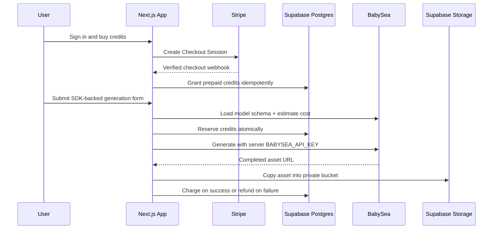

<div align="center">

# 🐧 generative-media-starter

**Launch a credit-based generative media app. Built with Next.js, Stripe, Supabase, Upstash, and the BabySea SDK.**

<br/>

[](https://babysea.ai)
[](#babysea-oss-taxonomy)
[](LICENSE)
[](#9-status)
[](https://sentry.io)
[](https://github.com/babysea-ai/generative-media-starter/actions/workflows/sentry-check.yml)
[](https://github.com/babysea-ai/generative-media-starter/actions/workflows/codeql.yml)
[](https://github.com/babysea-ai/generative-media-starter/actions/workflows/publish-check.yml)

<br/>

[](https://demo.generative-media-starter.babysea.live/)

<br/>

**Infrastructure**

[](https://babysea.ai)
[](https://nextjs.org)
[](https://react.dev)
[](https://stripe.com)
[](https://supabase.com)
[](https://upstash.com)

<br/>

_A working app boundary for auth, prepaid credits, private media storage, and BabySea SDK-backed generation._

<br/>

**One-click deploy**

[](https://vercel.com/new/clone?repository-url=https%3A%2F%2Fgithub.com%2Fbabysea-ai%2Fgenerative-media-starter&project-name=generative-media-starter&repository-name=generative-media-starter)
[](https://app.netlify.com/start/deploy?repository=https%3A%2F%2Fgithub.com%2Fbabysea-ai%2Fgenerative-media-starter)

</div>

---

## BabySea OSS taxonomy

BabySea open source projects are organized into three categories:

[](#babysea-oss-taxonomy)
[](#babysea-oss-taxonomy)
[](#babysea-oss-taxonomy)

| Category           | Description                                                                                                                        |
| :----------------- | :--------------------------------------------------------------------------------------------------------------------------------- |
| **OSS Primitives** | Reusable infrastructure boundaries extracted from BabySea's execution control plane. Each primitive focuses on one system concern. |
| **SDKs**           | Typed developer entry points for creating, tracking, and managing BabySea workloads from application code.                         |
| **OSS Starters**   | Deployable reference applications that combine product UI, auth, billing, storage, and BabySea execution patterns.                 |

## BabySea OSS architecture

```text
Application developers
  │
  ▼
generative-media-starter
  ├─ product UI, auth, billing, storage, and history
  ├─ starter-local Supabase credit ledger functions
  └─ server-side BabySea SDK calls
      │
      ▼
    babysea SDK
      │
      ▼
    BabySea execution control plane
      ├─ rosetta-bridge     request normalization
      ├─ adaptive-island    provider ranking
      ├─ execution-arrow    /v1/generate image/video execution (coming-soon)
      └─ ledger-fortress    credit settlement pattern
```

## Table of contents

1. [Overview](#1-overview)
   - [What this is](#what-this-is)
   - [Short version](#short-version)
   - [Production lineage](#production-lineage)
   - [Grounding rule](#grounding-rule)
   - [Adoption path](#adoption-path)
2. [Stack contract](#2-stack-contract)
3. [Terminology](#3-terminology)
4. [Boundaries](#4-boundaries)
5. [Architecture](#5-architecture)
6. [Quick start](#6-quick-start)
   - [Clone and install](#clone-and-install)
   - [Configure Supabase](#configure-supabase)
   - [Configure BabySea](#configure-babysea)
   - [Configure Stripe credit packs](#configure-stripe-credit-packs)
   - [Configure Upstash rate limiting](#configure-upstash-rate-limiting)
   - [Validate setup](#validate-setup)
   - [Run locally](#run-locally)
   - [Deploy on Vercel or Netlify](#deploy-on-vercel-or-netlify)
7. [Core capabilities](#7-core-capabilities)
   - [Why it's different](#why-its-different)
   - [The credit lifecycle](#the-credit-lifecycle)
   - [The generation lifecycle](#the-generation-lifecycle)
   - [Private media storage](#private-media-storage)
   - [Operational guardrails](#operational-guardrails)
   - [Customization guide](#customization-guide)
8. [Production readiness](#8-production-readiness)
   - [Environment variables](#environment-variables)
   - [Production checklist](#production-checklist)
   - [Troubleshooting](#troubleshooting)
   - [Security notes](#security-notes)
9. [Status](#9-status)
10. [Community](#10-community)
    - [Related resources](#related-resources)
    - [Contributing](#contributing)
11. [License](#11-license)
12. [Acknowledgements](#12-acknowledgements)

---

## 1. Overview

### What this is

`generative-media-starter` is a working Next.js starter application for launching a prepaid generative media product on top of BabySea. It includes the product surface around BabySea execution: landing page, Google auth, dashboard, credit packs, Stripe Checkout, webhook grants, generation form, private media storage, signed asset history, and deployment guides.

### Short version

The starter gives you a deployable app where users sign in, buy prepaid credits, submit a generation, reserve credits before dispatch, generate through the server-side `babysea` TypeScript SDK, copy the finished asset into private Supabase Storage, and either charge or refund the reservation.

### Production lineage

`generative-media-starter` mirrors BabySea's production execution model without dumping internal product code. BabySea owns the execution control plane behind the SDK. The starter owns the community app boundary that builders usually need first: auth, prepaid billing, ledger settlement, private asset storage, rate limits, and deployment readiness.

### Grounding rule

Public starter behavior is limited to the app implemented in this repository: Next.js App Router, Supabase Auth/Postgres/Storage, Stripe one-time credit packs, Supabase RPC credit settlement, Upstash-backed production rate limits, and BabySea SDK execution for the default model. If a feature is not implemented here or documented in the linked starter docs, it is out of scope for this starter.

### Adoption path

Fork or clone the repo, connect your Supabase project, create Stripe Prices for the credit packs, add a server-only BabySea API key, configure Upstash for production rate limiting, run `pnpm run doctor`, and deploy to Vercel or Netlify. Then customize the model, form, pricing, styling, and storage policies for your product.

## 2. Stack contract

| Layer                | Required stack             | Runtime responsibility                                                                                    |
| -------------------- | -------------------------- | --------------------------------------------------------------------------------------------------------- |
| Product runtime      | Next.js App Router + React | Render landing, auth, dashboard, billing, generation history, and server actions.                         |
| Authentication       | Supabase Auth              | Google OAuth sign-in and user-owned dashboard access.                                                     |
| Operational database | Supabase Postgres          | Store balances, immutable ledger events, generation records, Stripe customers, and processed webhook IDs. |
| Credit settlement    | Supabase RPC functions     | Atomically grant, reserve, charge, and refund credits.                                                    |
| Billing              | Stripe Checkout + webhooks | Sell one-time prepaid credit packs and grant credits idempotently.                                        |
| Execution            | BabySea TypeScript SDK     | Load model schema, estimate cost, create generation, wait for completion, and return asset URLs.          |
| Private storage      | Supabase Storage           | Copy completed media into a private `generated-media` bucket and serve signed URLs.                       |
| Rate limiting        | Upstash Redis              | Enforce per-user generation limits in production.                                                         |
| Deployment           | Vercel or Netlify          | Host the Next.js app and Stripe webhook route.                                                            |

No provider credentials, queues, cron jobs, user-managed inference-provider keys, or provider-specific request code are part of the starter contract.

The default starter surface is intentionally narrow:

- one model: `bfl/flux-schnell`
- one execution surface: the official `babysea` TypeScript SDK
- one pricing convention: dollar-denominated app credits
- two dashboard sections: Generate and Billing
- one private storage bucket: `generated-media`
- two deployment targets: Vercel and Netlify

## 3. Terminology

| Term               | Meaning in this starter                                                                          |
| ------------------ | ------------------------------------------------------------------------------------------------ |
| App credit         | Dollar-denominated prepaid balance. The default convention is `$10 = $10 credits`.               |
| Credit pack        | One-time Stripe Checkout product that grants a fixed credit amount after a verified webhook.     |
| Reservation        | A pre-dispatch atomic credit hold created before calling BabySea generation.                     |
| Charge             | Terminal success settlement for a completed generation.                                          |
| Refund             | Terminal failure settlement that returns a previous reservation.                                 |
| Generation record  | User-owned Supabase row that tracks prompt, status, cost, storage path, and completion metadata. |
| Private media copy | The completed asset copied from the BabySea result URL into Supabase Storage.                    |
| Signed asset URL   | A short-lived Supabase Storage URL used to display private generated media in history.           |

## 4. Boundaries

- Not a managed BabySea service or hosted SaaS product.
- Not a provider marketplace, provider router, or multi-model admin console.
- Not a replacement for the `babysea` SDK; the starter intentionally calls the SDK instead of provider-specific APIs.
- Not a bring-your-own-provider-key application. End users never paste inference-provider credentials.
- Not a general payment abstraction. Billing is Stripe Checkout with one-time credit packs.
- Not a queue, worker, or cron-based execution platform. The starter uses standard Next.js server-side execution paths.
- Not a Sentry runtime telemetry integration. Sentry code guard is repository-only for ownership, Seer, and scheduled project wiring checks.

## 5. Architecture



The settlement invariant is simple: a generation cannot spend credits unless a reservation ledger event exists, and failed provider dispatch refunds the reservation.

## 6. Quick start

### Clone and install

```bash
git clone https://github.com/babysea-ai/generative-media-starter.git
cd generative-media-starter
pnpm install
cp .env.example .env.local
```

This starter includes `.npmrc` with `ignore-workspace=true` so `pnpm install` works in a standalone clone. If you vendor the starter inside a larger pnpm monorepo and pnpm still detects the parent workspace, run:

```bash
pnpm install --ignore-workspace
```

### Configure Supabase

Create a Supabase project and add these values to `.env.local`:

| Supabase value       | Env var                           |
| -------------------- | --------------------------------- |
| Project URL          | `NEXT_PUBLIC_SUPABASE_URL`        |
| Publishable/anon key | `NEXT_PUBLIC_SUPABASE_PUBLIC_KEY` |
| Service role key     | `SUPABASE_SECRET_KEY`             |
| Project ref          | `SUPABASE_PROJECT_REF`            |

Apply the migrations:

```bash
export SUPABASE_PROJECT_REF=your-project-ref
pnpm supabase:link
pnpm supabase:push
pnpm supabase:typegen
```

The migrations create:

- `credit_balances`
- `credit_ledger`
- `generations`
- `stripe_customers`
- `processed_stripe_events`
- RPC functions for granting, reserving, charging, and refunding credits
- RLS policies for user-owned reads
- a private `generated-media` storage bucket

See [docs/supabase.md](docs/supabase.md) for auth URL setup, service-role safety, and verification steps.

### Configure BabySea

Create a BabySea API key with generation read/write access and set it server-side:

```bash
BABYSEA_API_KEY=bye_...
```

Keep this key server-only. Do not prefix it with `NEXT_PUBLIC_` and do not expose it in browser code. The app uses the official `babysea` TypeScript SDK to load model schema and pricing at runtime.

### Configure Stripe credit packs

Create one active one-time Checkout Price for each credit pack in `lib/app-config.ts`.

| Pack            | Credits | Amount | Lookup key                                     |
| --------------- | ------: | -----: | ---------------------------------------------- |
| Starter Pack    |     $10 |    $10 | `generative_media_starter_starter_usd_1000`    |
| Builder Pack    |     $25 |    $25 | `generative_media_starter_builder_usd_2500`    |
| Production Pack |     $50 |    $50 | `generative_media_starter_production_usd_5000` |

Credit values are dollar-denominated: `$10 = $10 credits`. The default generation price is `$0.005/output`.

The app resolves Prices by lookup key by default. For locked-down production deployments, you can optionally set direct Price ID overrides:

```bash
STRIPE_PRICE_STARTER=price_...
STRIPE_PRICE_BUILDER=price_...
STRIPE_PRICE_PRODUCTION=price_...
```

In production, add a Stripe webhook endpoint:

```text
https://your-app.example.com/api/stripe/webhook
```

Listen for:

- `checkout.session.completed`
- `checkout.session.async_payment_succeeded`

Then set:

```bash
STRIPE_SECRET_KEY=sk_...
STRIPE_WEBHOOK_SECRET=whsec_...
```

See [docs/stripe.md](docs/stripe.md) for CLI commands and the production webhook checklist.

### Configure Upstash rate limiting

Upstash is optional only for local development. In production, create a Redis database and set:

```bash
UPSTASH_REDIS_REST_URL=...
UPSTASH_REDIS_REST_TOKEN=...
```

If these variables are missing locally, generation still works without remote rate limiting. In production, the app requires them before accepting generation requests.

### Validate setup

After `.env.local` is filled and migrations are applied, run:

```bash
pnpm run doctor
```

The doctor verifies environment variables, BabySea schema/cost access, Stripe Prices, Supabase tables/storage, Upstash connectivity, and Vercel/Netlify deployment configuration. It never prints secret values.

### Run locally

```bash
pnpm dev
```

Open <http://localhost:3011>, sign in with Google, buy a test credit pack with Stripe test cards, then generate media from the dashboard.

### Deploy on Vercel or Netlify

#### Vercel

Create a Vercel project with these settings:

| Setting             | Value                                               |
| ------------------- | --------------------------------------------------- |
| Framework           | Next.js                                             |
| Root Directory      | Empty for a standalone repo                         |
| Install Command     | `pnpm install --frozen-lockfile --ignore-workspace` |
| Build Command       | `pnpm build`                                        |
| Development Command | `pnpm dev`                                          |

#### Netlify

Click the Netlify one-click deploy button or create a Netlify site from the GitHub repository. The checked-in `netlify.toml` configures the build:

| Setting           | Value                                                             |
| ----------------- | ----------------------------------------------------------------- |
| Build Command     | `pnpm install --frozen-lockfile --ignore-workspace && pnpm build` |
| Publish Directory | `.next`                                                           |
| Node Version      | `20`                                                              |

Netlify's official Next.js runtime handles App Router routes, Route Handlers, and the Supabase auth-refresh proxy through Netlify Functions. No edge-runtime conversion is required.

Add every runtime variable from `.env.example` to Vercel or Netlify. Do not add `SUPABASE_PROJECT_REF`; it is only used by local Supabase CLI scripts.

For production, set:

```bash
NEXT_PUBLIC_SITE_URL=https://your-app.example.com
```

If you attach a custom domain after the first deploy, update Vercel or Netlify, Supabase Auth URLs, and the Stripe webhook endpoint, then redeploy.

See [docs/deploy-vercel.md](docs/deploy-vercel.md) for the Vercel-specific deployment checklist and [docs/deploy-netlify.md](docs/deploy-netlify.md) for the Netlify-specific deployment checklist.

## 7. Core capabilities

### Why it's different

This is not a thin demo form around an image-generation API. It ships the operational app boundary that a prepaid generative media product needs: authenticated users, credit purchases, idempotent grants, atomic reservations, terminal settlement, private generated assets, signed history URLs, rate limits, and deployment preflight checks.

### The credit lifecycle

```text
Stripe Checkout paid
  ▼
verified webhook event
  ▼
processed_stripe_events idempotency gate
  ▼
grant_credits(...) RPC
  ▼
credit_balances + immutable credit_ledger
  ▼
reserve before BabySea dispatch
  ▼
charge on success or refund on failure
```

All mutating credit operations go through Supabase RPC functions. Browser code reads user-owned state through RLS and never receives the Supabase service role key.

### The generation lifecycle

The generation flow is deliberately SDK-first:

1. Load the configured BabySea model metadata.
2. Validate the submitted prompt and form fields.
3. Ask BabySea for the estimated generation cost.
4. Reserve the required app credits in Supabase.
5. Create and wait for the generation with server-side `BABYSEA_API_KEY`.
6. Copy the completed media into private Supabase Storage.
7. Mark the generation complete and charge the reservation.
8. Refund the reservation if dispatch or storage fails.

### Private media storage

Generated assets are copied into the private `generated-media` bucket. The dashboard displays them through signed Supabase Storage URLs rather than exposing a public bucket or relying on provider-hosted URLs for history.

### Operational guardrails

- Supabase RLS protects user-owned reads.
- Stripe webhook events are processed idempotently.
- Credit reservations are created before generation dispatch.
- Failed generation paths refund reserved credits.
- Upstash rate limits are required in production.
- `pnpm run doctor` verifies external service readiness before deployment.
- Secret values are never printed by the doctor.

### Customization guide

- Change the model in `lib/app-config.ts`.
- Keep pricing and schema strict by reading BabySea SDK model metadata and estimates before accepting form submissions.
- Add model-specific fields in `app/dashboard/generate/page.tsx` and validate them in `app/dashboard/generate/actions.ts`.
- Add or change credit packs in `lib/app-config.ts`, then create matching Stripe Prices with the same lookup keys.
- Keep generated files private by storing them in the `generated-media` bucket.

See [docs/customization.md](docs/customization.md) for safe model, credit-pack, auth, and storage customization.

## 8. Production readiness

### Environment variables

| Env var                           | Required   | Scope          | Notes                                |
| --------------------------------- | ---------- | -------------- | ------------------------------------ |
| `NEXT_PUBLIC_SITE_URL`            | Yes        | Browser/server | App origin for Stripe redirects.     |
| `BABYSEA_API_KEY`                 | Yes        | Server         | Server-only BabySea key.             |
| `BABYSEA_API_BASE_URL`            | No         | Server         | Defaults to the BabySea US API.      |
| `STRIPE_SECRET_KEY`               | Yes        | Server         | Stripe secret key.                   |
| `STRIPE_WEBHOOK_SECRET`           | Yes        | Server         | Stripe webhook signing secret.       |
| `STRIPE_PRICE_STARTER`            | No         | Server         | Optional direct Starter Price ID.    |
| `STRIPE_PRICE_BUILDER`            | No         | Server         | Optional direct Builder Price ID.    |
| `STRIPE_PRICE_PRODUCTION`         | No         | Server         | Optional direct Production Price ID. |
| `NEXT_PUBLIC_SUPABASE_URL`        | Yes        | Browser/server | Supabase project URL.                |
| `NEXT_PUBLIC_SUPABASE_PUBLIC_KEY` | Yes        | Browser/server | Supabase publishable/anon key.       |
| `SUPABASE_SECRET_KEY`             | Yes        | Server         | Supabase service role key.           |
| `SUPABASE_PROJECT_REF`            | CLI only   | Local          | Used by Supabase CLI scripts.        |
| `UPSTASH_REDIS_REST_URL`          | Production | Server         | Enables rate limiting.               |
| `UPSTASH_REDIS_REST_TOKEN`        | Production | Server         | Enables rate limiting.               |

### Production checklist

- [ ] `.env.local` and Vercel or Netlify environment variables contain real secrets.
- [ ] No secret files are committed.
- [ ] Supabase migrations are applied.
- [ ] Supabase Auth Site URL matches your deployed domain.
- [ ] Supabase redirect URL pattern is configured if using link-based auth.
- [ ] Stripe Prices exist for every lookup key.
- [ ] Optional `STRIPE_PRICE_*` overrides point to active one-time USD Prices.
- [ ] Stripe webhook points to `/api/stripe/webhook` on your final domain.
- [ ] `NEXT_PUBLIC_SITE_URL` matches your final domain.
- [ ] `BABYSEA_API_KEY` is server-only.
- [ ] Upstash rate limiting is enabled for production.
- [ ] `pnpm run doctor` passes before deployment.
- [ ] A full test purchase and generation succeeds in production.

### Troubleshooting

| Symptom                                     | Fix                                                                              |
| ------------------------------------------- | -------------------------------------------------------------------------------- |
| Stripe Checkout returns to the wrong host   | Update `NEXT_PUBLIC_SITE_URL` in Vercel or Netlify and redeploy.                 |
| Google sign-in redirects fail               | Add `https://your-app.example.com/auth/callback` to Supabase Auth redirect URLs. |
| Checkout succeeds but credits do not appear | Verify the Stripe webhook URL, event type, and `STRIPE_WEBHOOK_SECRET`.          |
| Generation is disabled                      | Set a valid server-side `BABYSEA_API_KEY`.                                       |
| Generation says insufficient credits        | Complete a test Checkout session or grant credits in Supabase for development.   |
| Assets fail to display                      | Confirm the `generated-media` bucket exists and migrations ran.                  |
| Rate limit exceeded                         | Wait for the configured Upstash window or tune `lib/rate-limit.ts`.              |

### Security notes

- Never commit `.env`, `.env.local`, `.env.production`, Vercel export files, or Netlify secret exports.
- Keep BabySea, Stripe, Supabase service-role, Upstash, Vercel, Netlify, and GitHub tokens in deployment secrets only.
- Rotate any secret that was pasted into a terminal, chat, issue, or screenshot.
- The Supabase service role is used only in trusted server actions and webhooks.
- Browser code only receives publishable keys.
- Sentry code guard is repository-only for ownership, Seer, and scheduled project-wiring checks; this starter does not include a Sentry SDK, DSN, tracing, or runtime telemetry.

## 9. Status

`generative-media-starter` is a **working OSS starter** (`v0.1.0`). It is built and validated as a deployable BabySea application boundary with community-owned infrastructure. Fork it, run `pnpm run doctor`, deploy it to Vercel or Netlify, and customize the product surface for your own generative media business.

Current starter surface:

- [x] Supabase Google OAuth auth
- [x] Stripe Checkout credit packs
- [x] Idempotent Stripe webhook grants
- [x] Atomic reserve, charge, and refund functions in Postgres
- [x] BabySea SDK schema loading for the generation form
- [x] BabySea SDK cost estimates before reserve
- [x] Server-only BabySea API key usage
- [x] Private Supabase Storage for generated media
- [x] Signed asset URLs in generation history
- [x] Upstash-backed production rate limiting
- [x] Vercel deployment configuration
- [x] Netlify deployment configuration
- [x] Preflight doctor for service readiness

## 10. Community

### Related resources

- 🌊 [BabySea SDK](https://github.com/babysea-ai/babysea): the production TypeScript SDK this starter uses for schema loading, cost estimates, generation, and lifecycle handling.
- 🚀 [docs/deploy-vercel.md](docs/deploy-vercel.md): Vercel deployment guide.
- 🧭 [docs/deploy-netlify.md](docs/deploy-netlify.md): Netlify deployment guide.
- 🗄️ [docs/supabase.md](docs/supabase.md): Supabase Auth, Postgres, and Storage setup.
- 💳 [docs/stripe.md](docs/stripe.md): Stripe Checkout price and webhook setup.
- 🎛️ [docs/customization.md](docs/customization.md): safe model, credit-pack, auth, and storage customization.

### Contributing

We welcome PRs, issues, and design discussion. See [CONTRIBUTING.md](CONTRIBUTING.md) and [SECURITY.md](SECURITY.md).

## 11. License

[Apache License 2.0](LICENSE). Use it, fork it, ship it. Just keep the notice.

## 12. Acknowledgements

Built with **Next.js**, **Stripe**, **Supabase**, **Upstash**, **Vercel**, **Netlify**, and **BabySea**.
