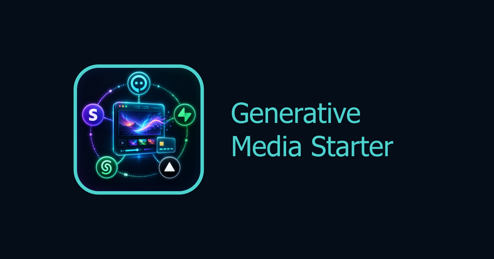

<div align="center">

<p>
  <a>
    
  </a>
</p>

<h1>
  Generative Media Starter
</h1>

<p>
  Credit-based generative media app. Built with Next.js, Stripe, Supabase, Upstash, and the BabySea SDK.
</p>

<p>
  <strong>A working app boundary for auth, prepaid credits, private media storage, and BabySea SDK-backed generation.</strong>
</p>

<br />

<a href="https://demo.generative-media-starter.babysea.live">
  
</a>

<br />
<br />

<a>
  
</a>

<br />

<a>
  
</a>

<br/>
<br/>

<strong>Project</strong>

[](#babysea-oss-taxonomy)
[](#status)
[](LICENSE)
[](https://sentry.io)
[](https://github.com/babysea-ai/generative-media-starter/actions/workflows/sentry-check.yml)
[](https://github.com/babysea-ai/generative-media-starter/actions/workflows/codeql.yml)
[](https://github.com/babysea-ai/generative-media-starter/actions/workflows/publish-check.yml)

<br/>

<strong>Built with</strong>

[](https://nextjs.org)
[](https://react.dev)
[](https://babysea.ai)
[](https://stripe.com)
[](https://supabase.com)
[](https://upstash.com)
[](https://www.netlify.com)
[](https://vercel.com)

<br/>

<strong>One-click deploy</strong>

[](https://vercel.com/new/clone?repository-url=https%3A%2F%2Fgithub.com%2Fbabysea-ai%2Fgenerative-media-starter&project-name=generative-media-starter&repository-name=generative-media-starter&env=NEXT_PUBLIC_SITE_URL,BABYSEA_API_KEY,STRIPE_SECRET_KEY,STRIPE_WEBHOOK_SECRET,NEXT_PUBLIC_SUPABASE_URL,NEXT_PUBLIC_SUPABASE_PUBLIC_KEY,SUPABASE_SECRET_KEY,UPSTASH_REDIS_REST_URL,UPSTASH_REDIS_REST_TOKEN)
[](https://app.netlify.com/start/deploy?repository=https://github.com/babysea-ai/generative-media-starter)

</div>

---

## BabySea OSS taxonomy

BabySea open source projects are organized into three categories:

[](#babysea-oss-taxonomy)
[](#babysea-oss-taxonomy)
[](#babysea-oss-taxonomy)

| Category      | Description                                                                                                                                       |
| :------------ | :------------------------------------------------------------------------------------------------------------------------------------------------ |
| **SDK**       | Typed developer entry points for creating, tracking, and managing BabySea workloads from application code.                                        |
| **Primitive** | Reusable infrastructure boundaries extracted from BabySea's execution control plane. Each primitive focuses on one system concern.                |
| **Starter**   | Deployable reference applications that combine product UI, auth, storage, and BabySea execution patterns. Some starters may also include billing. |

## Status

BabySea OSS projects are published into three status levels:

[](#status)
[](#status)
[](#status)

| Status         | Description                                                                                                                                                                          |
| :------------- | :----------------------------------------------------------------------------------------------------------------------------------------------------------------------------------- |
| **Working**    | Fully implemented and deployable. All documented capabilities function as described. Suitable for personal and small-team use. No breaking-change guarantees between versions.       |
| **Production** | Working plus a hardened public runtime contract. Validated against a stated infrastructure stack with deterministic behavior, explicit failure modes, and a documented upgrade path. |
| **Alpha**      | Early-stage implementation. Core structure exists but some capabilities may be incomplete, undocumented, or subject to breaking changes. Not recommended for production deployments. |

`generative-media-starter` is a **working** OSS starter. It is built and validated as a deployable BabySea application boundary for auth, prepaid credits, private media storage, and SDK-backed generation. See [`CHANGELOG.md`](CHANGELOG.md).

## Table of contents

1. [Overview](#1-overview)
   - [What this is](#what-this-is)
   - [Short version](#short-version)
   - [Production lineage](#production-lineage)
   - [Grounding rule](#grounding-rule)
   - [Adoption path](#adoption-path)
2. [Stack contract](#2-stack-contract)
3. [Terminology](#3-terminology)
4. [Boundaries](#4-boundaries)
5. [Architecture](#5-architecture)
6. [Quick start](#6-quick-start)
   - [Clone and install](#clone-and-install)
   - [Configure Supabase](#configure-supabase)
   - [Configure BabySea](#configure-babysea)
   - [Configure Stripe credit packs](#configure-stripe-credit-packs)
   - [Configure Upstash rate limiting](#configure-upstash-rate-limiting)
   - [Validate and run](#validate-and-run)
   - [Deploy](#deploy)
7. [Core capabilities](#7-core-capabilities)
   - [Why it's different](#why-its-different)
   - [The credit lifecycle](#the-credit-lifecycle)
   - [The generation lifecycle](#the-generation-lifecycle)
   - [Private media storage](#private-media-storage)
   - [Operational guardrails](#operational-guardrails)
   - [Customization guide](#customization-guide)
8. [Production readiness](#8-production-readiness)
   - [Environment variables](#environment-variables)
   - [Checklist](#checklist)
   - [Troubleshooting](#troubleshooting)
   - [Security notes](#security-notes)
9. [Version surface](#9-version-surface)
10. [Community](#10-community)
    - [Who's using it](#whos-using-it)
    - [Related resources](#related-resources)
    - [Contributing](#contributing)
11. [License](#11-license)

---

## 1. Overview

### What this is

`generative-media-starter` is a Next.js starter for launching a prepaid generative media product on BabySea. It includes the app boundary around execution: landing page, Google auth, dashboard, credit packs, Stripe Checkout, webhook grants, generation form, private media storage, signed asset history, rate limiting, and deployment guides.

### Short version

Users sign in, buy prepaid credits, submit a generation, reserve credits before dispatch, generate through the server-side `babysea` TypeScript SDK, copy the finished asset into private Supabase Storage, and settle the reservation with a charge or refund.

### Production lineage

The starter mirrors BabySea's production execution model without publishing internal product code. BabySea owns the execution control plane behind the SDK. The starter owns the community application boundary: auth, prepaid billing, ledger settlement, private asset storage, rate limits, and deployment readiness.

### Grounding rule

Public starter behavior is limited to this repository: Next.js App Router, Supabase Auth/Postgres/Storage, Stripe one-time credit packs, Supabase RPC credit settlement, Upstash-backed production rate limits, and BabySea SDK execution for the default model. Features not implemented here or documented in linked starter docs are out of scope.

### Adoption path

Fork or clone the repo, connect Supabase, create Stripe Prices for the credit packs, add a server-only BabySea API key, configure Upstash for production rate limiting, run `pnpm run doctor`, and deploy to Vercel or Netlify. Then customize the model, form, pricing, styling, and storage policies for your product.

## 2. Stack contract

| Layer                | Required stack             | Runtime responsibility                                                                                    |
| :------------------- | :------------------------- | :-------------------------------------------------------------------------------------------------------- |
| Product runtime      | Next.js App Router + React | Render landing, auth, dashboard, billing, generation history, and server actions.                         |
| Authentication       | Supabase Auth              | Google OAuth sign-in and user-owned dashboard access.                                                     |
| Operational database | Supabase Postgres          | Store balances, immutable ledger events, generation records, Stripe customers, and processed webhook IDs. |
| Credit settlement    | Supabase RPC functions     | Atomically grant, reserve, charge, and refund credits.                                                    |
| Billing              | Stripe Checkout + webhooks | Sell one-time prepaid credit packs and grant credits idempotently.                                        |
| Execution            | BabySea TypeScript SDK     | Load model schema, estimate cost, create generation, wait for completion, and return asset URLs.          |
| Private storage      | Supabase Storage           | Copy completed media into a private `generated-media` bucket and serve signed URLs.                       |
| Rate limiting        | Upstash Redis              | Enforce per-user generation limits in production.                                                         |
| Deployment           | Vercel or Netlify          | Host the Next.js app and Stripe webhook route.                                                            |

No provider credentials, queues, cron jobs, user-managed inference-provider keys, or provider-specific request code are part of this starter contract.

## 3. Terminology

| Term               | Meaning in this starter                                                                          |
| :----------------- | :----------------------------------------------------------------------------------------------- |
| App credit         | Dollar-denominated prepaid balance. The default convention is `$10 = $10 credits`.               |
| Credit pack        | One-time Stripe Checkout product that grants a fixed credit amount after a verified webhook.     |
| Reservation        | Pre-dispatch atomic credit hold created before calling BabySea generation.                       |
| Charge             | Terminal success settlement for a completed generation.                                          |
| Refund             | Terminal failure settlement that returns a previous reservation.                                 |
| Generation record  | User-owned Supabase row that tracks prompt, status, cost, storage path, and completion metadata. |
| Private media copy | Completed asset copied from the BabySea result URL into Supabase Storage.                        |
| Signed asset URL   | Short-lived Supabase Storage URL used to display private generated media in history.             |

## 4. Boundaries

- Not a managed BabySea service or hosted SaaS product.
- Not a provider marketplace, provider router, or multi-model admin console.
- Not a replacement for the `babysea` SDK; the starter intentionally calls the SDK instead of provider-specific APIs.
- Not a bring-your-own-provider-key application; end users never paste inference-provider credentials.
- Not a general payment abstraction; billing is Stripe Checkout with one-time credit packs.
- Not a queue, worker, or cron-based execution platform.
- Not a Sentry runtime telemetry integration; Sentry code guard is repository-only.

## 5. Architecture

```text
User
  | sign in and buy credits
  v
Next.js App -> Stripe Checkout
  | verified webhook
  v
Supabase Postgres grant_credits(...)
  | user submits generation
  v
BabySea SDK schema + cost estimate
  | reserve credits
  v
BabySea generation
  | completed asset URL
  v
Supabase Storage private copy
  | terminal settlement
  v
charge on success or refund on failure
```

The settlement invariant is simple: a generation cannot spend credits unless a reservation ledger event exists, and failed dispatch refunds the reservation.

## 6. Quick start

### Clone and install

```bash
git clone https://github.com/babysea-ai/generative-media-starter.git
cd generative-media-starter
pnpm install
cp .env.example .env.local
```

The starter includes its own `pnpm-workspace.yaml` and `.npmrc` so catalog dependencies resolve inside a standalone clone, matching the package layout used by the other BabySea OSS starters.

### Configure Supabase

Create a Supabase project and add these values to `.env.local`:

| Supabase value       | Env var                           |
| :------------------- | :-------------------------------- |
| Project URL          | `NEXT_PUBLIC_SUPABASE_URL`        |
| Publishable/anon key | `NEXT_PUBLIC_SUPABASE_PUBLIC_KEY` |
| Service role key     | `SUPABASE_SECRET_KEY`             |
| Project ref          | `SUPABASE_PROJECT_REF`            |

Apply the migrations:

```bash
export SUPABASE_PROJECT_REF=your-project-ref
pnpm supabase:link
pnpm supabase:push
pnpm supabase:typegen
```

See [`docs/supabase.md`](docs/supabase.md) for auth URL setup, service-role safety, and verification steps.

### Configure BabySea

Create a BabySea API key with generation read/write access and keep it server-only:

```bash
BABYSEA_API_KEY=bye_...
```

Do not prefix it with `NEXT_PUBLIC_`. The app uses the official `babysea` TypeScript SDK to load model schema and pricing at runtime.

### Configure Stripe credit packs

Create one active one-time Checkout Price for each pack in `lib/app-config.ts`:

| Pack            | Credits | Amount | Lookup key                                     |
| :-------------- | ------: | -----: | :--------------------------------------------- |
| Starter Pack    |     $10 |    $10 | `generative_media_starter_starter_usd_1000`    |
| Builder Pack    |     $25 |    $25 | `generative_media_starter_builder_usd_2500`    |
| Production Pack |     $50 |    $50 | `generative_media_starter_production_usd_5000` |

In production, point Stripe webhooks at `https://your-app.example.com/api/stripe/webhook` and listen for `checkout.session.completed` plus `checkout.session.async_payment_succeeded`. See [`docs/stripe.md`](docs/stripe.md) for CLI commands and the production webhook checklist.

### Configure Upstash rate limiting

Upstash is optional for local development and required for production generation requests:

```bash
UPSTASH_REDIS_REST_URL=...
UPSTASH_REDIS_REST_TOKEN=...
```

### Validate and run

```bash
pnpm run doctor
pnpm dev
```

Open <http://localhost:3011>, sign in with Google, buy a test credit pack with Stripe test cards, and generate media from the dashboard.

### Deploy

Deploy to Vercel or Netlify. Add every runtime variable from `.env.example` to the hosting provider and set:

```bash
NEXT_PUBLIC_SITE_URL=https://your-app.example.com
```

See [`docs/deploy-vercel.md`](docs/deploy-vercel.md) and [`docs/deploy-netlify.md`](docs/deploy-netlify.md) for deployment checklists.

## 7. Core capabilities

### Why it's different

This is not a thin demo form around an image-generation API. It ships the operational app boundary a prepaid generative media product needs: authenticated users, credit purchases, idempotent grants, atomic reservations, terminal settlement, private generated assets, signed history URLs, rate limits, and preflight checks.

### The credit lifecycle

```text
Stripe Checkout paid
  v
verified webhook event
  v
processed_stripe_events idempotency gate
  v
grant_credits(...) RPC
  v
credit_balances + immutable credit_ledger
  v
reserve before BabySea dispatch
  v
charge on success or refund on failure
```

Browser code reads user-owned state through RLS and never receives the Supabase service role key.

### The generation lifecycle

1. Load the configured BabySea model metadata.
2. Validate the submitted prompt and form fields.
3. Ask BabySea for the estimated generation cost.
4. Reserve the required app credits in Supabase.
5. Create and wait for the generation with server-side `BABYSEA_API_KEY`.
6. Copy completed media into private Supabase Storage.
7. Mark the generation complete and charge the reservation.
8. Refund the reservation if dispatch or storage fails.

### Private media storage

Generated assets are copied into the private `generated-media` bucket. The dashboard displays them through signed Supabase Storage URLs instead of exposing a public bucket or relying on provider-hosted URLs for history.

### Operational guardrails

- Supabase RLS protects user-owned reads.
- Stripe webhook events are processed idempotently.
- Credit reservations are created before generation dispatch.
- Failed generation paths refund reserved credits.
- Upstash rate limits are required in production.
- `pnpm run doctor` verifies external service readiness without printing secrets.

### Customization guide

- Change the model in `lib/app-config.ts`.
- Keep pricing and schema strict by reading BabySea SDK model metadata and estimates before accepting form submissions.
- Add model-specific fields in `app/dashboard/generate/page.tsx` and validate them in `app/dashboard/generate/_lib/server-actions.ts`.
- Add or change credit packs in `lib/app-config.ts`, then create matching Stripe Prices.
- Keep generated files private by storing them in `generated-media`.

See [`docs/customization.md`](docs/customization.md) for safe model, credit-pack, auth, and storage customization.

## 8. Production readiness

### Environment variables

| Env var                           | Required   | Scope          | Notes                                |
| :-------------------------------- | :--------- | :------------- | :----------------------------------- |
| `NEXT_PUBLIC_SITE_URL`            | Yes        | Browser/server | App origin for Stripe redirects.     |
| `BABYSEA_API_KEY`                 | Yes        | Server         | Server-only BabySea key.             |
| `BABYSEA_API_BASE_URL`            | No         | Server         | Defaults to the BabySea US API.      |
| `STRIPE_SECRET_KEY`               | Yes        | Server         | Stripe secret key.                   |
| `STRIPE_WEBHOOK_SECRET`           | Yes        | Server         | Stripe webhook signing secret.       |
| `STRIPE_PRICE_STARTER`            | No         | Server         | Optional direct Starter Price ID.    |
| `STRIPE_PRICE_BUILDER`            | No         | Server         | Optional direct Builder Price ID.    |
| `STRIPE_PRICE_PRODUCTION`         | No         | Server         | Optional direct Production Price ID. |
| `NEXT_PUBLIC_SUPABASE_URL`        | Yes        | Browser/server | Supabase project URL.                |
| `NEXT_PUBLIC_SUPABASE_PUBLIC_KEY` | Yes        | Browser/server | Supabase publishable/anon key.       |
| `SUPABASE_SECRET_KEY`             | Yes        | Server         | Supabase service role key.           |
| `SUPABASE_PROJECT_REF`            | CLI only   | Local          | Used by Supabase CLI scripts.        |
| `UPSTASH_REDIS_REST_URL`          | Production | Server         | Enables rate limiting.               |
| `UPSTASH_REDIS_REST_TOKEN`        | Production | Server         | Enables rate limiting.               |

### Checklist

- [ ] `.env.local` and deployment environment variables contain real secrets.
- [ ] No secret files are committed.
- [ ] Supabase migrations are applied.
- [ ] Supabase Auth Site URL and Redirect URLs match your deployed domain.
- [ ] Stripe Prices exist for every lookup key.
- [ ] Stripe webhook points to `/api/stripe/webhook` on your final domain.
- [ ] `NEXT_PUBLIC_SITE_URL` matches your final domain.
- [ ] `BABYSEA_API_KEY` is server-only.
- [ ] Upstash rate limiting is enabled for production.
- [ ] `pnpm run doctor` passes before deployment.
- [ ] A full test purchase and generation succeeds in production.

### Troubleshooting

| Symptom                                     | Fix                                                                              |
| :------------------------------------------ | :------------------------------------------------------------------------------- |
| Stripe Checkout returns to the wrong host   | Update `NEXT_PUBLIC_SITE_URL` in Vercel or Netlify and redeploy.                 |
| Google sign-in redirects fail               | Add `https://your-app.example.com/auth/callback` to Supabase Auth redirect URLs. |
| Checkout succeeds but credits do not appear | Verify the Stripe webhook URL, event type, and `STRIPE_WEBHOOK_SECRET`.          |
| Generation is disabled                      | Set a valid server-side `BABYSEA_API_KEY`.                                       |
| Generation says insufficient credits        | Complete a test Checkout session or grant credits in Supabase for development.   |
| Assets fail to display                      | Confirm the `generated-media` bucket exists and migrations ran.                  |
| Rate limit exceeded                         | Wait for the configured Upstash window or tune `lib/rate-limit.ts`.              |

### Security notes

- Never commit `.env`, `.env.local`, `.env.production`, Vercel export files, or Netlify secret exports.
- Keep BabySea, Stripe, Supabase service-role, Upstash, Vercel, Netlify, and GitHub tokens in deployment secrets only.
- Rotate any secret that was pasted into a terminal, chat, issue, or screenshot.
- Browser code only receives publishable keys.
- Sentry code guard is repository-only; this starter does not include a Sentry runtime SDK.

## 9. Version surface

Current version surface:

- [x] Supabase Google OAuth auth
- [x] Stripe Checkout credit packs
- [x] Idempotent Stripe webhook grants
- [x] Atomic reserve, charge, and refund functions in Postgres
- [x] BabySea SDK schema loading and cost estimates before reserve
- [x] Server-only BabySea API key usage
- [x] Private Supabase Storage for generated media
- [x] Signed asset URLs in generation history
- [x] Upstash-backed production rate limiting
- [x] Vercel and Netlify deployment configuration
- [x] Preflight doctor for service readiness

New features stay out of the public contract until they are implemented, documented, and validated in this starter.

## 10. Community

### Who's using it

- **[BabySea](https://babysea.ai)**: this starter demonstrates the community app boundary around BabySea SDK-backed generation, prepaid credits, and private media storage.

_Using `generative-media-starter`? Open a PR to add yourself._

### Related resources

- [BabySea SDK](https://github.com/babysea-ai/babysea): Production TypeScript SDK used for schema loading, cost estimates, and generation.
- [`docs/deploy-vercel.md`](docs/deploy-vercel.md): Vercel deployment guide.
- [`docs/deploy-netlify.md`](docs/deploy-netlify.md): Netlify deployment guide.
- [`docs/supabase.md`](docs/supabase.md): Supabase Auth, Postgres, and Storage setup.
- [`docs/stripe.md`](docs/stripe.md): Stripe Checkout price and webhook setup.
- [`docs/customization.md`](docs/customization.md): Safe model, credit-pack, auth, and storage customization.

### Contributing

We welcome PRs, issues, and design discussion. See [`CONTRIBUTING.md`](CONTRIBUTING.md), [`CODE_OF_CONDUCT.md`](CODE_OF_CONDUCT.md), and [`SECURITY.md`](SECURITY.md).

## 11. License

[Apache License 2.0](LICENSE). Use it, fork it, ship it. Just keep the notice.
