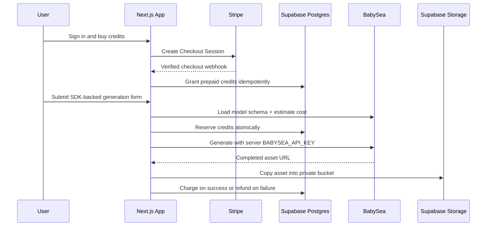

<div align="center">

# 🐧 Generative Media Starter

**Launch a credit-based generative media app.<br/>
Built with Next.js, Stripe, Supabase, Upstash, and the BabySea SDK.**

<br/>

[](https://babysea.ai)
[](#what-this-is)
[](LICENSE)
[](#status)
[](https://sentry.io)
[](https://github.com/babysea-ai/generative-media-starter/actions/workflows/sentry-check.yml)
[](https://github.com/babysea-ai/generative-media-starter/actions/workflows/codeql.yml)
[](https://github.com/babysea-ai/generative-media-starter/actions/workflows/publish-check.yml)

<br/>

[](https://demo.generative-media-starter.babysea.live/)

<br/>

**Infrastructure**

[](https://babysea.ai)
[](https://nextjs.org)
[](https://react.dev)
[](https://stripe.com)
[](https://supabase.com)
[](https://upstash.com)

<br/>

_A working deployable app for auth, prepaid credits, private media storage, and BabySea SDK generation._

<br/>

**One-click deploy**

[](https://vercel.com/new/clone?repository-url=https%3A%2F%2Fgithub.com%2Fbabysea-ai%2Fgenerative-media-starter&project-name=generative-media-starter&repository-name=generative-media-starter)
[](https://app.netlify.com/start/deploy?repository=https%3A%2F%2Fgithub.com%2Fbabysea-ai%2Fgenerative-media-starter)

</div>

## What this is

`generative-media-starter` is a working Next.js starter application for launching a prepaid generative media product on top of BabySea.

It **mirrors BabySea's production execution model**, without dumping internal product code. The starter keeps the operational shape that matters for builders: users buy credits, the app reserves credits before provider dispatch, BabySea runs the generation behind a server-managed API key, the generated asset is copied into private storage, and credits are settled on success or refunded on failure.

The default app is intentionally focused:

- one model: `bfl/flux-schnell`
- one execution surface: the official `babysea` TypeScript SDK
- one pricing unit: dollar-denominated app credits
- two dashboard sections: Generate and Billing
- one production route: Vercel-hosted or Netlify-hosted Next.js

BabySea handles provider routing behind the SDK and model schema. The starter handles the product surface around that execution contract.

## Stack contract

| Layer                | Required stack             | Runtime responsibility                                                                                    |
| -------------------- | -------------------------- | --------------------------------------------------------------------------------------------------------- |
| Product runtime      | Next.js App Router + React | Render landing, auth, dashboard, billing, and generation history.                                         |
| Authentication       | Supabase Auth              | Google OAuth sign-in and user-owned dashboard access.                                                     |
| Operational database | Supabase Postgres          | Store balances, immutable ledger events, generation records, Stripe customers, and processed webhook IDs. |
| Credit settlement    | Supabase RPC functions     | Atomically grant, reserve, charge, and refund credits.                                                    |
| Billing              | Stripe Checkout + webhooks | Sell one-time prepaid credit packs and grant credits idempotently.                                        |
| Execution            | BabySea TypeScript SDK     | Load model schema, estimate cost, create generation, wait for completion, and return asset URLs.          |
| Private storage      | Supabase Storage           | Copy completed media into a private `generated-media` bucket and serve signed URLs.                       |
| Rate limiting        | Upstash Redis              | Enforce per-user generation limits in production.                                                         |
| Deployment           | Vercel or Netlify          | Host the Next.js app and Stripe webhook route.                                                            |

No provider credentials, queues, cron jobs, or user-managed inference-provider keys are part of the starter contract.

## What this is not

This starter is not a managed BabySea service, a provider marketplace, or a multi-model admin console. It does not ask end users to paste provider API keys. It also does not bypass the BabySea SDK with provider-specific request code.

The goal is a clean, production-shaped baseline that teams can fork, deploy, and customize without rebuilding auth, billing, credit settlement, private asset storage, and generation lifecycle handling from scratch.

## Architecture



The settlement invariant is simple: a generation cannot spend credits unless a reserve ledger event exists, and failed provider dispatch refunds the reservation.

## Quick start

### 1. Clone and install

```bash
git clone https://github.com/babysea-ai/generative-media-starter.git
cd generative-media-starter
pnpm install
cp .env.example .env.local
```

This starter includes `.npmrc` with `ignore-workspace=true` so `pnpm install` works in a standalone clone. If you vendor the starter inside a larger pnpm monorepo and pnpm still detects the parent workspace, run:

```bash
pnpm install --ignore-workspace
```

### 2. Configure Supabase

Create a Supabase project and add these values to `.env.local`:

| Supabase value       | Env var                           |
| -------------------- | --------------------------------- |
| Project URL          | `NEXT_PUBLIC_SUPABASE_URL`        |
| Publishable/anon key | `NEXT_PUBLIC_SUPABASE_PUBLIC_KEY` |
| Service role key     | `SUPABASE_SECRET_KEY`             |
| Project ref          | `SUPABASE_PROJECT_REF`            |

Apply the migrations:

```bash
export SUPABASE_PROJECT_REF=your-project-ref
pnpm supabase:link
pnpm supabase:push
pnpm supabase:typegen
```

The migrations create:

- `credit_balances`
- `credit_ledger`
- `generations`
- `stripe_customers`
- `processed_stripe_events`
- RPC functions for granting, reserving, charging, and refunding credits
- RLS policies for user-owned reads
- a private `generated-media` storage bucket

See [docs/supabase.md](docs/supabase.md) for auth URL setup, service-role safety, and verification steps.

### 3. Configure BabySea

Create a BabySea API key with generation read/write access and set it server-side:

```bash
BABYSEA_API_KEY=bye_...
```

Keep this key server-only. Do not prefix it with `NEXT_PUBLIC_` and do not expose it in browser code. The app uses the official `babysea` TypeScript SDK to load model schema and pricing at runtime.

### 4. Configure Stripe credit packs

Create one active one-time Checkout Price for each credit pack in `lib/app-config.ts`.

| Pack            | Credits | Amount | Lookup key                                     |
| --------------- | ------: | -----: | ---------------------------------------------- |
| Starter Pack    |     $10 |    $10 | `generative_media_starter_starter_usd_1000`    |
| Builder Pack    |     $25 |    $25 | `generative_media_starter_builder_usd_2500`    |
| Production Pack |     $50 |    $50 | `generative_media_starter_production_usd_5000` |

Credit values are dollar-denominated: $10 = $10 credits. The default generation price is $0.005/output.

The app resolves Prices by lookup key by default. For locked-down production deployments, you can optionally set direct Price ID overrides:

```bash
STRIPE_PRICE_STARTER=price_...
STRIPE_PRICE_BUILDER=price_...
STRIPE_PRICE_PRODUCTION=price_...
```

In production, add a Stripe webhook endpoint:

```text
https://your-app.example.com/api/stripe/webhook
```

Listen for:

- `checkout.session.completed`
- `checkout.session.async_payment_succeeded`

Then set:

```bash
STRIPE_SECRET_KEY=sk_...
STRIPE_WEBHOOK_SECRET=whsec_...
```

See [docs/stripe.md](docs/stripe.md) for CLI commands and the production webhook checklist.

### 5. Configure Upstash rate limiting

Upstash is optional only for local development. In production, create a Redis database and set:

```bash
UPSTASH_REDIS_REST_URL=...
UPSTASH_REDIS_REST_TOKEN=...
```

If these variables are missing locally, generation still works without remote rate limiting. In production, the app requires them before accepting generation requests.

### 6. Validate setup

After `.env.local` is filled and migrations are applied, run:

```bash
pnpm run doctor
```

The doctor verifies environment variables, BabySea schema/cost access, Stripe Prices, Supabase tables/storage, Upstash connectivity, and Vercel/Netlify deployment configuration. It never prints secret values.

### 7. Run locally

```bash
pnpm dev
```

Open <http://localhost:3011>, sign in with Google, buy a test credit pack with Stripe test cards, then generate media from the dashboard.

### 8. Deploy on Vercel or Netlify

#### Vercel

Create a Vercel project with these settings:

| Setting             | Value                                               |
| ------------------- | --------------------------------------------------- |
| Framework           | Next.js                                             |
| Root Directory      | Empty for a standalone repo                         |
| Install Command     | `pnpm install --frozen-lockfile --ignore-workspace` |
| Build Command       | `pnpm build`                                        |
| Development Command | `pnpm dev`                                          |

#### Netlify

Click the Netlify one-click deploy button or create a Netlify site from the GitHub repository. The checked-in `netlify.toml` configures the build:

| Setting           | Value                                                             |
| ----------------- | ----------------------------------------------------------------- |
| Build Command     | `pnpm install --frozen-lockfile --ignore-workspace && pnpm build` |
| Publish Directory | `.next`                                                           |
| Node Version      | `20`                                                              |

Netlify's official Next.js runtime handles App Router routes, Route Handlers, and the Supabase auth-refresh proxy through Netlify Functions. No edge-runtime conversion is required.

Add every runtime variable from `.env.example` to Vercel or Netlify. Do not add `SUPABASE_PROJECT_REF`; it is only used by local Supabase CLI scripts.

For production, set:

```bash
NEXT_PUBLIC_SITE_URL=https://your-app.example.com
```

If you attach a custom domain after the first deploy, update Vercel or Netlify, Supabase Auth URLs, and the Stripe webhook endpoint, then redeploy.

See [docs/deploy-vercel.md](docs/deploy-vercel.md) for the Vercel-specific deployment checklist and [docs/deploy-netlify.md](docs/deploy-netlify.md) for the Netlify-specific deployment checklist.

## Environment variables

| Env var                           | Required   | Scope          | Notes                                |
| --------------------------------- | ---------- | -------------- | ------------------------------------ |
| `NEXT_PUBLIC_SITE_URL`            | Yes        | Browser/server | App origin for Stripe redirects.     |
| `BABYSEA_API_KEY`                 | Yes        | Server         | Server-only BabySea key.             |
| `BABYSEA_API_BASE_URL`            | No         | Server         | Defaults to the BabySea US API.      |
| `STRIPE_SECRET_KEY`               | Yes        | Server         | Stripe secret key.                   |
| `STRIPE_WEBHOOK_SECRET`           | Yes        | Server         | Stripe webhook signing secret.       |
| `STRIPE_PRICE_STARTER`            | No         | Server         | Optional direct Starter Price ID.    |
| `STRIPE_PRICE_BUILDER`            | No         | Server         | Optional direct Builder Price ID.    |
| `STRIPE_PRICE_PRODUCTION`         | No         | Server         | Optional direct Production Price ID. |
| `NEXT_PUBLIC_SUPABASE_URL`        | Yes        | Browser/server | Supabase project URL.                |
| `NEXT_PUBLIC_SUPABASE_PUBLIC_KEY` | Yes        | Browser/server | Supabase publishable/anon key.       |
| `SUPABASE_SECRET_KEY`             | Yes        | Server         | Supabase service role key.           |
| `SUPABASE_PROJECT_REF`            | CLI only   | Local          | Used by Supabase CLI scripts.        |
| `UPSTASH_REDIS_REST_URL`          | Production | Server         | Enables rate limiting.               |
| `UPSTASH_REDIS_REST_TOKEN`        | Production | Server         | Enables rate limiting.               |

## Current starter surface

- [x] Supabase Google OAuth auth
- [x] Stripe Checkout credit packs
- [x] Idempotent Stripe webhook grants
- [x] Atomic reserve, charge, and refund functions in Postgres
- [x] BabySea SDK schema loading for the generation form
- [x] BabySea SDK cost estimates before reserve
- [x] Server-only BabySea API key usage
- [x] Private Supabase Storage for generated media
- [x] Signed asset URLs in generation history
- [x] Upstash-backed production rate limiting
- [x] Vercel deployment configuration
- [x] Netlify deployment configuration
- [x] Preflight doctor for service readiness

## Customization guide

- Change the model in `lib/app-config.ts`.
- Keep pricing and schema strict by reading BabySea SDK model metadata and estimates before accepting form submissions.
- Add model-specific fields in `app/dashboard/generate/page.tsx` and validate them in `app/dashboard/generate/actions.ts`.
- Add or change credit packs in `lib/app-config.ts`, then create matching Stripe Prices with the same lookup keys.
- Keep generated files private by storing them in the `generated-media` bucket.

## Production checklist

- [ ] `.env.local` and Vercel or Netlify environment variables contain real secrets.
- [ ] No secret files are committed.
- [ ] Supabase migrations are applied.
- [ ] Supabase Auth Site URL matches your deployed domain.
- [ ] Supabase redirect URL pattern is configured if using link-based auth.
- [ ] Stripe Prices exist for every lookup key.
- [ ] Optional `STRIPE_PRICE_*` overrides point to active one-time USD Prices.
- [ ] Stripe webhook points to `/api/stripe/webhook` on your final domain.
- [ ] `NEXT_PUBLIC_SITE_URL` matches your final domain.
- [ ] `BABYSEA_API_KEY` is server-only.
- [ ] Upstash rate limiting is enabled for production.
- [ ] `pnpm run doctor` passes before deployment.
- [ ] A full test purchase and generation succeeds in production.

## Troubleshooting

| Symptom                                     | Fix                                                                              |
| ------------------------------------------- | -------------------------------------------------------------------------------- |
| Stripe Checkout returns to the wrong host   | Update `NEXT_PUBLIC_SITE_URL` in Vercel or Netlify and redeploy.                 |
| Google sign-in redirects fail               | Add `https://your-app.example.com/auth/callback` to Supabase Auth redirect URLs. |
| Checkout succeeds but credits do not appear | Verify the Stripe webhook URL, event type, and `STRIPE_WEBHOOK_SECRET`.          |
| Generation is disabled                      | Set a valid server-side `BABYSEA_API_KEY`.                                       |
| Generation says insufficient credits        | Complete a test Checkout session or grant credits in Supabase for development.   |
| Assets fail to display                      | Confirm the `generated-media` bucket exists and migrations ran.                  |
| Rate limit exceeded                         | Wait for the configured Upstash window or tune `lib/rate-limit.ts`.              |

## Security notes

- Never commit `.env`, `.env.local`, `.env.production`, Vercel export files, or Netlify secret exports.
- Keep BabySea, Stripe, Supabase service-role, Upstash, Vercel, Netlify, and GitHub tokens in deployment secrets only.
- Rotate any secret that was pasted into a terminal, chat, issue, or screenshot.
- The Supabase service role is used only in trusted server actions and webhooks.
- Browser code only receives publishable keys.
- Sentry code guard is repository-only for ownership, Seer, and scheduled project-wiring checks; this starter does not include a Sentry SDK, DSN, tracing, or runtime telemetry.

## Status

`generative-media-starter` is a **working OSS starter** (`v0.1.0`). It is built and validated as a deployable BabySea application boundary with community-owned infrastructure. Fork it, run `pnpm run doctor`, deploy it to Vercel or Netlify, and customize the product surface for your own generative media business.

## Related resources

- 🌊 [BabySea SDK](https://github.com/babysea-ai/babysea): the production TypeScript SDK this starter uses for schema loading, cost estimates, generation, and lifecycle handling.
- 🚀 [docs/deploy-vercel.md](docs/deploy-vercel.md): Vercel deployment guide.
- 🧭 [docs/deploy-netlify.md](docs/deploy-netlify.md): Netlify deployment guide.
- 🗄️ [docs/supabase.md](docs/supabase.md): Supabase Auth, Postgres, and Storage setup.
- 💳 [docs/stripe.md](docs/stripe.md): Stripe Checkout price and webhook setup.
- 🎛️ [docs/customization.md](docs/customization.md): safe model, credit-pack, auth, and storage customization.

## Contributing

We welcome PRs, issues, and design discussion. See [CONTRIBUTING.md](CONTRIBUTING.md) and [SECURITY.md](SECURITY.md).

## License

[Apache License 2.0](LICENSE). Use it, fork it, ship it. Just keep the notice.

## Acknowledgements

Built with **Next.js**, **Supabase**, **Stripe**, **Upstash**, **Vercel**, and **BabySea**.
